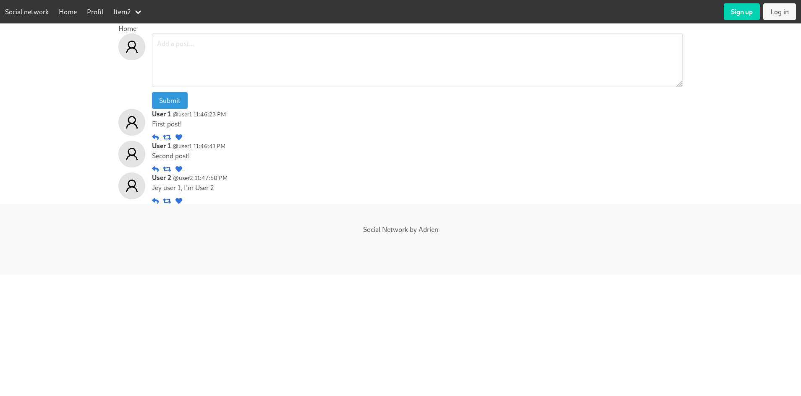

# Travail

## Semaine 1

Peu de code cette semaine, mais plutôt une réflexion sur le cahier des charges.
Le titre du sujet étant "Réseau social interne à une structure", l'objectif est de faire un réseau social plutôt classique, c'est à dire reprenant les codes généraux présents dans tous les réseaux sociaux (timeline, posts, commentaires, likes, relations d'amitié ou de "follow" entre les utilisateurs...), dont une instance peut être facilement déployée et personnalisée par une structure (entreprises, écoles, communautés diverses...).
Les possiblités de personnalisation et de configuration étant primordiales dans ce projet, le développement se fera le plus possible de manière modulaire: à l'exception du coeur de l'appplication (les fonctionnalités les plus basiques d'un réseau social), la plupart des fonctionnalités seront implémentées sous forme de modules/plugins.
Ainsi, une organisation souhaitant deployer une instance de ce réseau social pourra facilement modifier non seulement le thème mais également les fonctionnalités présente. Elle pourra par exemple décider ou non d'activer un module de messagerie instantanée, ou bien changer le thème pour être en accord avec sa charte graphique.
Si besoin, il sera simple de développer de nouveaux modules pour répondre aux besoins de chaque organisation.

Les frameworks utilisés seront Django pour le back-end et Vue.js pour le front-end.

## Semaine 2

Mise en place de Webpack et Vue.js avec Django (finalement utilisation de django-webpack-loader au moins pour l'instant)
Début de la construction du front-end (components App, Post)
Début api (login, register)

## Semaine 3

Construction du front-end (composant pour les posts)
Mise en place API posts pour supporter le front-end
Ebauche du design du site (voir screenshot)

